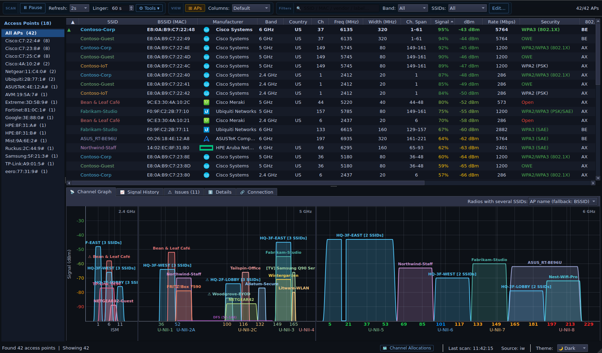

# WaveScope

> A modern, fast WiFi analyzer for Linux — built with PyQt6 and Python.



---

## About

WaveScope is an open-source WiFi analyzer designed for Linux desktops. It gives you a real-time, high-detail view of the wireless networks around you — from signal strength and channel occupancy to security modes, WiFi generations, and manufacturer data.

> 🤖 This application was built mostly using **Claude Code AI** (by Anthropic), with iterative development driven by human feedback.

---

## Features

- 📡 **Real-time channel graph** — per-band panels (2.4 GHz / 5 GHz / 6 GHz), no dead spectrum
- 📈 **Signal history plot** — rolling 2-minute time series per access point
- 🔍 **Rich AP metadata** — SSID, BSSID, manufacturer (OUI), band, channel, bandwidth, signal (dBm), security, WiFi generation, channel utilization, connected clients, 802.11k/v/r roaming support
- 🧰 **Troubleshooting tools** — Issues tab (configuration problems with explanations), side-by-side Compare, per-BSSID labels with wildcards, column profiles with pinned columns, Find AP beeper, saved sessions and CSV export; all preferences in one Settings dialog
- 🎯 **Single source of truth** — all BSS data comes from the kernel's scan cache via `iw`, cross-checked against Wireshark; NetworkManager is only asked to trigger scans (Tools ▸ Data Source keeps the legacy NetworkManager + iw mode)
- 🧭 **RF analysis** — per-channel congestion score, HE BSS-color collision alerts, roam candidates for the connected SSID, SNR and per-antenna RSSI for the current link
- 📶 **Wi-Fi 6E / 7 detail** — 6 GHz PSC markers and AP power type (LPI/SP/VLP), 320 MHz channels, EHT puncturing drawn on the graph, multi-link (MLD) grouping, co-located 6 GHz APs from the Reduced Neighbor Report
- 🔐 **Security detail** — WPA3 Personal/Enterprise/192-bit modes, SAE-EXT-KEY, SAE H2E/SAE-PK (RSNX), OWE transition pairs, 802.11r mobility domain
- 🏢 **AP name from vendor IEs** — physical AP names read from Cisco (IE 133), Aruba and Ubiquiti beacon IEs, shown in an **AP Name** column
- 📶 **TX power column** — per-AP transmit power from Cisco IE 150, Ruckus vendor IE and the standard 802.11h TPC Report
- 🗂️ **AP group sidebar** — groups the BSSIDs/radios of each physical AP; click a group to filter the table to it
- ⭐ **Known SSIDs** — keep a list of your own/notable SSIDs, then show only or hide them with one filter
- 🎨 **Dark / Light / Auto theme**
- 🏷️ **DFS channel indicator** — subtle amber marker on DFS channels in the 5 GHz band
- 🔒 **Manufacturer lookup** — IEEE OUI database (downloaded on demand, bundled fallback), WPS data and vendor IEs; detects Cisco Meraki from its vendor IE when the OUI database has no entry for newer hardware
- 🖼️ **Vendor icons** — logos for recognized manufacturers
- ⚡ **Configurable refresh rate** — 1s to 10s
- 💾 **Settings are saved between sessions** — theme, refresh interval, column widths and window layout
- 🩺 **Startup dependency check** — warns on launch if `nmcli`, `iw`, `tcpdump` or `pkexec` is missing and says what will not work without it
- 🖱️ **Interactive graphs** — click labels to highlight, scroll to zoom, drag to pan
- 🔎 **Filter & sort** — by any column, with text search
- 📦 **Packet capture** — two modes available via the toolbar:
  - **Monitor Mode**: raw 802.11 over-the-air capture of all frames on a chosen channel (all devices); temporarily disconnects WiFi, restored automatically on stop
  - **Managed Mode**: capture your own machine's traffic without disconnecting from the network; WiFi stays connected throughout
  - Both modes output standard `.pcap` files (Wireshark-compatible) and require a single root prompt

---

## Platform

| | |
|---|---|
| **OS** | Linux |
| **Packages** | `.deb` (Debian 12+, Ubuntu 24.04+), `.rpm` (Fedora, openSUSE), AppImage (any x86_64 distro with glibc 2.35+) |
| **Requires** | NetworkManager (`nmcli`), `iw`; `tcpdump` + polkit (`pkexec`) for packet capture |
| **Python** | 3.10 or newer |

---

## Installation

### Option A — Debian/Ubuntu (.deb package) ✅ Recommended

Download `wavescope_<version>_all.deb` from the [Releases](https://github.com/yurividal/WaveScope/releases) page:

```bash
sudo apt install ./wavescope_*_all.deb
wavescope
```

Requires Debian 12+ or Ubuntu 24.04+: the package uses the distro's `python3-pyqt6`, which Ubuntu 22.04 does not ship. On Ubuntu 22.04, use the AppImage (Option D) or run from source (Option E).

During installation a Python virtual environment is created in `/opt/wavescope/.venv` that uses the distro PyQt6, and `pyqtgraph` + `numpy` are installed into it from PyPI (versions pinned in `constraints.txt`). **This step needs internet access.** If it fails (offline, proxy, PyPI down), the package still installs and prints a warning. Fix it later with:

```bash
sudo /opt/wavescope/setup-venv.sh
```

**System dependencies** (pulled in automatically, from the package's `Depends:`):
```
python3 (>= 3.10), python3-pip, python3-venv, python3-pyqt6, pyqt6-dev-tools,
network-manager, iw, tcpdump, polkitd | policykit-1 | polkit | pkexec,
libxcb-cursor0, libxcb-xinerama0, libxcb-randr0
```
(`pyqt6-dev-tools` is there because it contains the `PyQt6.uic` module that pyqtgraph imports.)

---

### Option B — Fedora / RHEL (.rpm package) ✅ Recommended

Download `wavescope-<version>-1.fcNN.noarch.rpm` from the [Releases](https://github.com/yurividal/WaveScope/releases) page:

```bash
sudo dnf install ./wavescope-*.fc*.noarch.rpm
wavescope
```

Just like the .deb, `%post` sets up `/opt/wavescope/.venv` from PyPI (needs internet access; if it fails, the package still installs and you can re-run `sudo /opt/wavescope/setup-venv.sh`).

**System dependencies** (from the spec's `Requires:`):
```
python3 >= 3.10, python3-pip, python3-pyqt6, NetworkManager, iw, tcpdump,
polkit, xcb-util-cursor
```

---

### Option C — openSUSE (.rpm package) ✅ Recommended

Download `wavescope-<version>-1.opensuse.noarch.rpm` from the [Releases](https://github.com/yurividal/WaveScope/releases) page (Tumbleweed; Leap works if it provides Python >= 3.10 and PyQt6):

```bash
sudo zypper install --allow-unsigned-rpm ./wavescope-*.opensuse.noarch.rpm
wavescope
```

Same `/opt/wavescope/.venv` setup as above (needs internet access; recovery: `sudo /opt/wavescope/setup-venv.sh`).

**System dependencies** (from the spec's `Requires:`):
```
python3 >= 3.10, python3-pip, python3-qt6, NetworkManager, iw, tcpdump,
polkit, libxcb-cursor0, libgthread-2_0-0
```

---

### Option D — AppImage

Download `WaveScope-<version>-x86_64.AppImage` from the [Releases](https://github.com/yurividal/WaveScope/releases) page:

```bash
chmod +x WaveScope-*-x86_64.AppImage
./WaveScope-*-x86_64.AppImage
```

Notes:
- The AppImage bundles Python, PyQt6, pyqtgraph and numpy. It is built on Ubuntu 22.04 and needs glibc 2.35 or newer.
- `nmcli`, `iw`, `tcpdump` and `pkexec` still have to be installed on the host.

---

### Option E — Run from source

```bash
# Clone
git clone https://github.com/yurividal/WaveScope.git
cd WaveScope

# Install & run (creates .venv, installs packages)
chmod +x install.sh
./install.sh
./wavescope
```

`install.sh` detects **apt** (Debian/Ubuntu), **dnf** (Fedora) or **zypper** (openSUSE), lists any missing system packages together with the command to install them (and offers to run it when started from a terminal), and warns if `nmcli`, `iw`, `tcpdump` or `pkexec` is missing. On other distros it prints what to install by hand. It then creates `.venv` with PyQt6, pyqtgraph and numpy from PyPI (pinned by `constraints.txt`), writes the `./wavescope` launcher and adds a desktop entry for your user.

---

## Build packages from source

### .deb (Debian/Ubuntu)

```bash
# Requires: dpkg-dev
chmod +x scripts/build_deb.sh
./scripts/build_deb.sh
sudo apt install ./wavescope_*_all.deb
```

### .rpm (Fedora/RHEL)

```bash
# Requires: rpm-build
# sudo dnf install rpm-build
chmod +x scripts/build_rpm.sh
./scripts/build_rpm.sh
sudo dnf install ./wavescope-*.fc*.noarch.rpm
```

### .rpm (openSUSE)

```bash
# Requires: rpm-build
# sudo zypper install -y rpm-build
chmod +x scripts/build_opensuse.sh
./scripts/build_opensuse.sh
sudo zypper install --allow-unsigned-rpm ./wavescope-*.noarch.rpm
```

### AppImage

```bash
# Requires: appimagetool
# (Download from AppImageKit releases or install from your distro if available)
chmod +x scripts/build_appimage.sh
./scripts/build_appimage.sh

chmod +x WaveScope-*.AppImage
./WaveScope-*.AppImage
```

### AppImage (Docker, no host appimagetool needed)

Builds inside the same Ubuntu 22.04 image as the release CI (`scripts/docker/appimage-builder.Dockerfile`), running as your user so the output is not root-owned:

```bash
# Requires: docker
./scripts/build_appimage_docker.sh          # optional: pass a version, e.g. 2.0.1
./scripts/test_appimage_xvfb.sh WaveScope-*-x86_64.AppImage   # launch test on a bare Ubuntu 22.04 (Xvfb)

chmod +x WaveScope-*.AppImage
./WaveScope-*.AppImage
```

Manual equivalent:

```bash
docker build -t wavescope-appimage-builder:22.04 \
    -f scripts/docker/appimage-builder.Dockerfile scripts/docker
docker run --rm --user "$(id -u):$(id -g)" -e HOME=/tmp \
    -v "$PWD:/work" -w /work \
    wavescope-appimage-builder:22.04 ./scripts/build_appimage.sh
```

---

## Requirements

### System
- `nmcli` — provided by `network-manager`
- `iw` — for enriched scan data (WiFi generation, exact dBm, BSS load, etc.)
- `tcpdump` — required for packet capture (Monitor & Managed modes)
- `pkexec` — from polkit (`pkexec`/`polkitd`/`policykit-1` on Debian/Ubuntu, `polkit` on Fedora/openSUSE); required for root privilege during packet capture

### Python packages
- `PyQt6 >= 6.4.0` (from PyPI for source installs and the AppImage; from the distro for .deb/.rpm)
- `pyqtgraph >= 0.13.0`
- `numpy >= 1.23.0`

`requirements.txt` has the minimum versions. `constraints.txt` pins the exact versions that every install method uses.

---

## Contributing
See [CONTRIBUTING.md](CONTRIBUTING.md) for dev setup, linting, adding vendor IE parsers and packaging.

---

## Changelog
See [CHANGELOG.md](CHANGELOG.md) for release history.

---

## License

MIT License. See [LICENSE](LICENSE).
